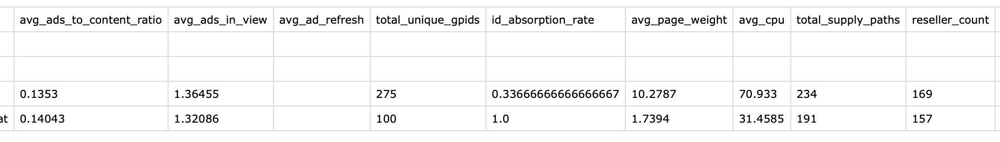

# Open Sincera Fetcher

A simple Python utility to batch-query **[Open Sincera](https://open.sincera.io)** publisher data for any list of domains.  
Built for **programmatic transparency, supply-path optimization (SPO)**, and **publisher intelligence**.

---

## Features

- Fetches publisher metadata from the Open Sincera API for any list of domains  
- Uses your personal Open Sincera API token (.env-based)  
- Outputs clean CSV with flattened fields (ready for Excel, BI tools, or Looker Studio)  
- Handles rate-limiting and request pacing automatically  

---

## Installation

Clone the repo and install dependencies:

```bash
git clone https://github.com/guedietz/open-sincera-fetcher.git
cd open-sincera-fetcher
pip install -r requirements.txt
```

Dependencies:

```
requests
python-dotenv
```

---

## Setup

1. **Create a `.env` file** in the project root:

   ```bash
   SINCERA_API_TOKEN=your_bearer_token_here
   ```

2. **Create a `domains.txt` file** with one domain per line:

   ```
   example.com
   newsportal.at
   blog.example.org
   ```

---

## Usage

```bash
python open-sincera-fetcher.py
```

The script will:

1. Read all domains from `domains.txt`
2. Query Open Sincera’s `/publishers` endpoint for each domain
3. Write results to a timestamped CSV file like:

```
open-sincera-io_results_20251103_193055.csv
```

Each row includes:

* Publisher metadata (ID, status, categories, owner domain, etc.)
* Input domain & API-returned domain
* API metrics such as `avg_ads_to_content_ratio`, `total_supply_paths`, `reseller_count`, etc.

---

## Example Output

Here’s a sneak peek of what the resulting CSV looks like:



---

## Configuration

Edit these constants in the script if needed:

| Variable             | Default                   | Description              |
| -------------------- | ------------------------- | ------------------------ |
| `INPUT_FILE`         | `domains.txt`             | Path to your domain list |
| `OUTPUT_FILE_PREFIX` | `open-sincera-io_results` | Prefix for output CSV    |
| `REQUEST_DELAY`      | `1.4` seconds             | Delay between API calls  |

---

## Why This Exists

As programmatic supply paths become increasingly complex, **data transparency** is essential.

This script makes it easy for programmatic teams, traders, and analysts to:

* Audit their publisher lists
* Monitor quality metrics
* Benchmark supply partners
* Feed insights into SPO strategies

---

## Contributing

tbd

---

## Author

**Günther Dietz**
Head of Business Development & Programmatic @ otago Online Consulting 🇦🇹
Building transparency & automation tools for the open web.

💼 [LinkedIn](https://linkedin.com/in/dietzguenther/) • 🧠 [GitHub](https://github.com/guedietz)

---

## 🪪 License

MIT License – free to use, modify, and share.